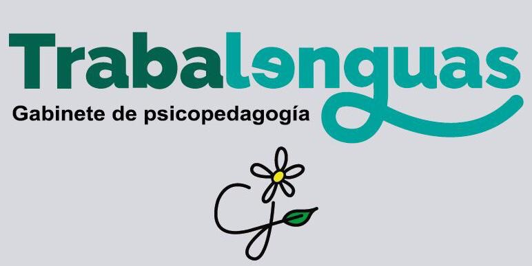

<!--

-->

## About Trabalenguas

Trabalenguas is a web application to perform your education center. It is divided in some modules, such as:

- Students Module
- Class Module
- Spending Module

## License

This is open-sourced software licensed under the GPL License.
